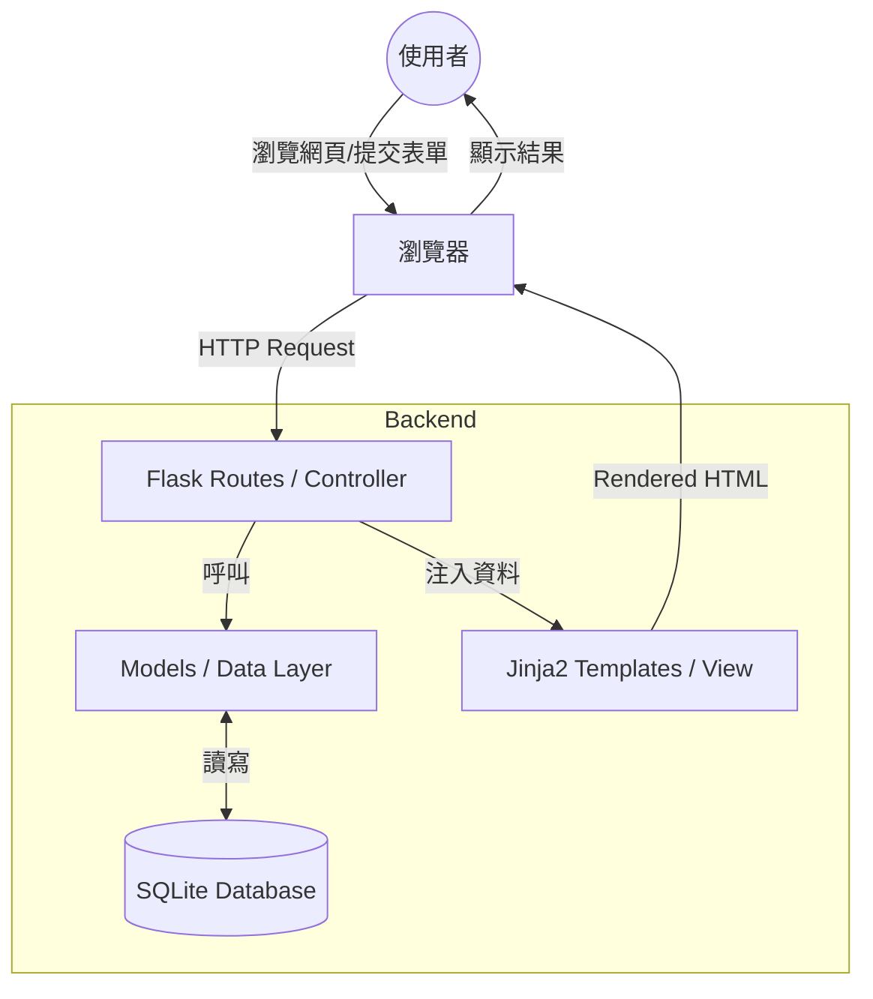

# 系統架構設計說明書 (ARCHITECTURE.md)

## 1. 技術架構說明
本專案採用經典的 **MVC (Model-View-Controller)** 模式進行開發，結合 Flask 輕量級框架，適合快速開發與學習。

### 技術選型
*   **後端框架 (Controller)**：Python + Flask。負責接收使用者請求、邏輯處理，並決定顯示哪個頁面。
*   **模板引擎 (View)**：Jinja2。搭配 HTML/CSS，負責將動態資料渲染進網頁。
*   **資料庫 (Model)**：SQLite + SQLAlchemy。負責定義資料結構與資料持久化。
*   **樣式與互動**：Vanilla CSS。確保介面加載快速且易於維護。

### MVC 模式分工
*   **Model (模型)**：定義資料表結構（如書籍、筆記、標籤），處理與資料庫的對話。
*   **View (視圖)**：Jinja2 模板，負責前端介面的呈現。
*   **Controller (控制器)**：Flask 路由，負責轉接使用者輸入並呼叫 Model 取得資料，最後回傳 View。

---

## 2. 專案資料夾結構
為了保持程式碼的可維護性，我們將採用以下結構：

```text
reading-notebook/
├── app/
│   ├── __init__.py       # 初始化 Flask App 與資料庫
│   ├── models/           # 資料庫模型 (SQLAlchemy Classes)
│   │   ├── book.py       # 書籍資料模型
│   │   ├── note.py       # 筆記資料模型
│   │   └── tag.py        # 標籤資料模型
│   ├── routes/           # 路由邏輯 (Blueprints)
│   │   ├── main.py       # 首頁與全域路由
│   │   ├── book.py       # 書籍管理路由
│   │   └── note.py       # 筆記管理路由
│   ├── static/           # 靜態資源
│   │   ├── css/          # 樣式表 (style.css)
│   │   └── js/           # JavaScript (如果有)
│   └── templates/        # Jinja2 HTML 模板
│       ├── base.html     # 基本佈局
│       ├── index.html    # 首頁
│       ├── book_list.html# 書籍清單頁面
│       └── note_edit.html# 筆記編輯頁面
├── instance/             # 存放資料庫檔案 (本地端)
│   └── database.db       # SQLite 資料庫檔案
├── docs/                 # 專案文件 (PRD, Architecture)
├── app.py                # 專案啟動入口
├── requirements.txt      # Python 套件清單
└── config.py             # 系統設定 (SECRET_KEY, DB 路徑)
```

---

## 3. 元件關係圖
以下說明資料如何在系統中流動：



---

## 4. 關鍵設計決策

1.  **使用 Blueprint 模組化路由**：
    *   **決策**：不將所有路由寫在 `app.py`，而是按功能（書籍、筆記）拆分。
    *   **原因**：方便開發與維護，多人協作時不易衝突。

2.  **SQLite + SQLAlchemy**：
    *   **決策**：選擇 SQLite 作為本地資料庫，並使用 SQLAlchemy 作為 ORM。
    *   **原因**：SQLite 無需安裝伺服器，適合個人工具；ORM 則讓資料操作更直覺且安全（避免 SQL Injection）。

3.  **Jinja2 Base Template 繼承**：
    *   **決策**：建立 `base.html` 統一導覽列、頁首頁尾。
    *   **原因**：減少代碼重複，確保全站 UI 風格一致。

4.  **Markdown 支援設計**：
    *   **決策**：筆記欄位在資料庫存儲為 Text 格式，渲染時由後端或前端進行 Markdown 轉換。
    *   **原因**：提供使用者更豐富的格式排版能力，符合「讀書筆記」的專業需求。
