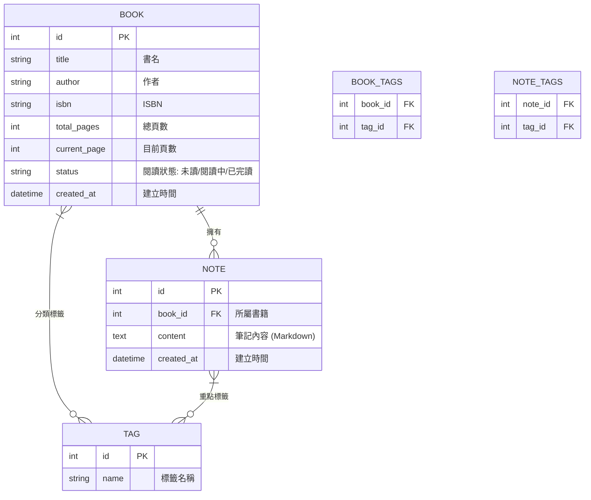

# 資料庫設計文件 (DB_DESIGN.md)

## 1. ER 圖 (Entity-Relationship Diagram)



---

## 2. 資料表詳細說明

### BOOK (書籍表)
| 欄位名 | 型別 | 說明 | 必填 | 備註 |
| :--- | :--- | :--- | :--- | :--- |
| id | INTEGER | 主鍵 | 是 | 自動遞增 |
| title | VARCHAR(255) | 書名 | 是 | |
| author | VARCHAR(255) | 作者 | 否 | |
| isbn | VARCHAR(20) | ISBN 編號 | 否 | |
| total_pages | INTEGER | 總頁數 | 否 | 預設 0 |
| current_page | INTEGER | 目前頁數 | 否 | 預設 0 |
| status | VARCHAR(50) | 閱讀狀態 | 是 | 未讀/閱讀中/已完讀 |
| created_at | DATETIME | 建立時間 | 是 | 預設為當下時間 |

### NOTE (筆記表)
| 欄位名 | 型別 | 說明 | 必填 | 備註 |
| :--- | :--- | :--- | :--- | :--- |
| id | INTEGER | 主鍵 | 是 | 自動遞增 |
| book_id | INTEGER | 所屬書籍 ID | 是 | 外鍵，參照 BOOK.id |
| content | TEXT | 筆記內容 | 是 | 支援 Markdown |
| created_at | DATETIME | 建立時間 | 是 | 預設為當下時間 |

### TAG (標籤表)
| 欄位名 | 型別 | 說明 | 必填 | 備註 |
| :--- | :--- | :--- | :--- | :--- |
| id | INTEGER | 主鍵 | 是 | 自動遞增 |
| name | VARCHAR(50) | 標籤名稱 | 是 | 唯一值 (Unique) |

---

## 3. SQL 建表語法 (database/schema.sql)

```sql
-- 書籍表
CREATE TABLE IF NOT EXISTS books (
    id INTEGER PRIMARY KEY AUTOINCREMENT,
    title TEXT NOT NULL,
    author TEXT,
    isbn TEXT,
    total_pages INTEGER DEFAULT 0,
    current_page INTEGER DEFAULT 0,
    status TEXT NOT NULL DEFAULT '未讀',
    created_at DATETIME DEFAULT CURRENT_TIMESTAMP
);

-- 筆記表
CREATE TABLE IF NOT EXISTS notes (
    id INTEGER PRIMARY KEY AUTOINCREMENT,
    book_id INTEGER NOT NULL,
    content TEXT NOT NULL,
    created_at DATETIME DEFAULT CURRENT_TIMESTAMP,
    FOREIGN KEY (book_id) REFERENCES books (id) ON DELETE CASCADE
);

-- 標籤表
CREATE TABLE IF NOT EXISTS tags (
    id INTEGER PRIMARY KEY AUTOINCREMENT,
    name TEXT NOT NULL UNIQUE
);

-- 書籍標籤關聯表
CREATE TABLE IF NOT EXISTS book_tags (
    book_id INTEGER NOT NULL,
    tag_id INTEGER NOT NULL,
    PRIMARY KEY (book_id, tag_id),
    FOREIGN KEY (book_id) REFERENCES books (id) ON DELETE CASCADE,
    FOREIGN KEY (tag_id) REFERENCES tags (id) ON DELETE CASCADE
);

-- 筆記標籤關聯表
CREATE TABLE IF NOT EXISTS note_tags (
    note_id INTEGER NOT NULL,
    tag_id INTEGER NOT NULL,
    PRIMARY KEY (note_id, tag_id),
    FOREIGN KEY (note_id) REFERENCES notes (id) ON DELETE CASCADE,
    FOREIGN KEY (tag_id) REFERENCES tags (id) ON DELETE CASCADE
);
```
