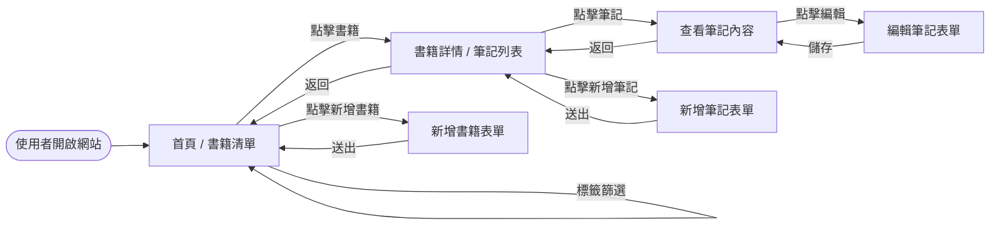
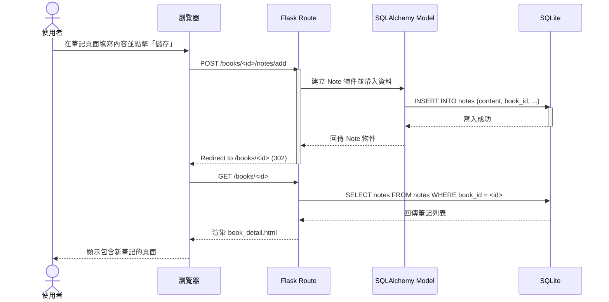

# 系統流程圖與操作路徑 (FLOWCHART.md)

## 1. 使用者流程圖 (User Flow)
描述使用者進入系統後，如何與各項功能進行互動。

---

## 2. 系統序列圖 (Sequence Diagram)
以「新增書籍筆記」為例，展示資料在不同元件間的流動過程。

---

## 3. 功能清單與路徑對照表 (Route Map)
根據架構設計規劃的路由對應。

| 功能名稱 | URL 路徑 | HTTP 方法 | 說明 |
| :--- | :--- | :--- | :--- |
| **首頁 (書籍清單)** | `/` | GET | 顯示所有書籍，支援標籤篩選 |
| **新增書籍** | `/books/add` | GET/POST | 顯示表單與處理新增邏輯 |
| **書籍詳情** | `/books/<int:id>` | GET | 顯示特定書籍資訊與該書筆記列表 |
| **刪除書籍** | `/books/<int:id>/delete` | POST | 刪除書籍及其關聯筆記 |
| **新增筆記** | `/books/<int:id>/notes/add` | GET/POST | 針對特定書籍新增筆記 |
| **編輯筆記** | `/notes/<int:id>/edit` | GET/POST | 編輯現有筆記內容 |
| **刪除筆記** | `/notes/<int:id>/delete` | POST | 刪除特定筆記 |
